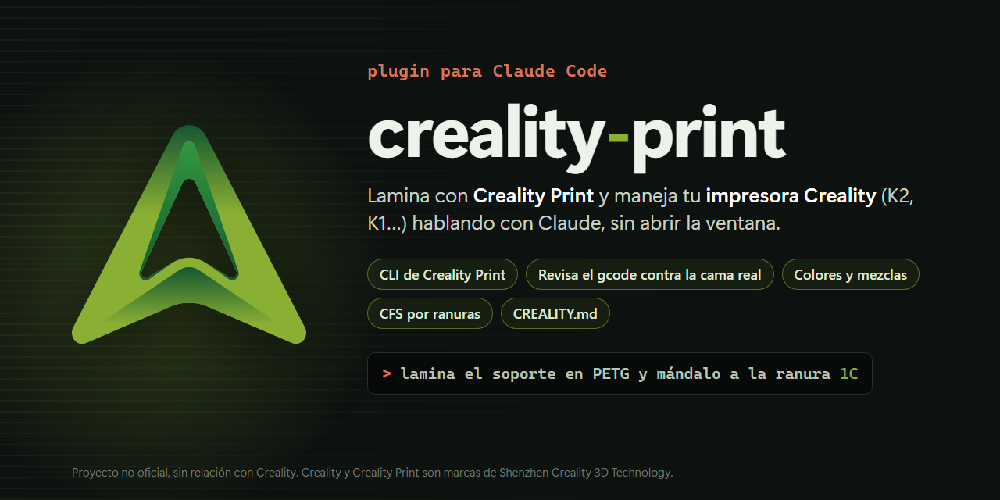

<p align="center"></p>

# claude-code-creality-print-plugin

Plugin de [Claude Code](https://code.claude.com) para laminar con **Creality Print** y
manejar tu **impresora Creality** (familia K2, familia K1…) hablando con Claude, sin abrir
la ventana y sin OrcaSlicer.

> **English summary:** a Claude Code plugin (MCP server + skill) that slices with Creality
> Print's own CLI, checks every gcode against the printer's *real* bed (catching the wrong
> profile that Creality Print sometimes switches to on its own), handles multi-colour —
> filament per object, colour change by height, and Creality Print 7 *mixed filaments* —
> adds screen thumbnails, and drives Creality OS printers the way Creality Print does:
> Moonraker to read and upload, and the port 9999 websocket (`colorMatch` +
> `multiColorPrint`) to start jobs on the CFS slot you choose. Per-project presets live in a
> `CREALITY.md`, like an `AGENTS.md`. Windows only; docs and tool descriptions are in Spanish.

## Qué hace

- **Lamina** STL, 3MF, OBJ y STEP con el motor de Creality Print, con los perfiles que
  tengas seleccionados, los de tu `CREALITY.md` o los que digas, y cambia los ajustes que
  pidas.
- **Revisa cada gcode contra la cama real de la impresora.** Rechaza el que es de otra
  máquina (un perfil de K2 Pro que Creality Print eligió solo en una K2, un 3MF bajado para
  una K1C) y el que saca el cabezal de la cama.
- **Colores:** un filamento por objeto, cambio de filamento a una altura y las **mezclas** de
  Creality Print 7 (filamentos virtuales que alternan dos colores).
- **Pone las miniaturas** para la pantalla de la impresora.
- **Lee** el estado de la impresora, el CFS, los archivos y el historial.
- **Sube gcodes y lanza impresiones como Creality Print:** por el websocket 9999 manda
  `colorMatch` (qué extrusor sale de qué ranura del CFS) y `multiColorPrint`. Así se elige la
  ranura, cosa que por Moonraker no se puede. Sin CFS, bobina externa.
- **Se acuerda de lo tuyo** en un `CREALITY.md`, global o por proyecto, como un AGENTS.md.

## Impresoras

Vale para las Creality con **Creality OS**: Klipper con Moonraker (puerto 7125) y el servicio
del puerto 9999 que usa Creality Print. Los modelos y el tamaño de su cama salen de la propia
lista de Creality Print, así que conoce todos los suyos.

| Impresora | Estado |
|---|---|
| K2 (260 mm) con CFS | **Probada** |
| K2 Pro, K2 Plus, K2 SE | Deberían funcionar, sin probar |
| K1, K1C, K1 Max, K1 SE (con o sin CFS-C) | Deberían funcionar, sin probar |
| Otras con Creality OS (Hi, Ender-3 V3 KE…) | Deberían funcionar, sin probar |
| Creality con Marlin (Ender-3 clásicas, CR-10…) | Laminar sí; hablar con la impresora, no |

Si pruebas otra, abre un issue y cuéntalo.

## Herramientas MCP

| Herramienta | Qué hace | ¿Mueve la impresora? |
|---|---|---|
| `configurar_impresora` | Busca la impresora (Creality Print o red local) y la guarda | no |
| `ver_preconfiguracion`, `guardar_preconfiguracion` | Los `CREALITY.md` que aplican a un modelo; crearlos o cambiarlos | no |
| `mis_notas`, `guardar_nota`, `borrar_nota` | Tus reglas, en el `CREALITY.md` global | no |
| `creality_print_info` | Instalación, versión, perfiles seleccionados, impresora de destino | no |
| `listar_perfiles` | Perfiles de máquina, proceso o filamento (solo los de tu máquina) | no |
| `ver_ajustes_perfil` | Claves y valores de un perfil ya resuelto | no |
| `ver_objetos_3mf`, `preparar_multicolor` | Objetos de un 3MF; colores por objeto y por altura | no |
| `laminar` | Lamina y revisa; también mezclas. Devuelve `apto`, problemas, tiempo, gramos, extrusores | no |
| `analizar_gcode` | Revisa un gcode local o de la impresora | no |
| `abrir_en_creality_print` | Abre un archivo en una ventana para mirarlo | no |
| `estado_impresora`, `estado_cfs`, `archivos_impresora`, `historial_impresora` | Lectura | no |
| `subir_gcode` | Sube un gcode ya revisado, sin imprimirlo | no |
| `imprimir` | Lanza la impresión con las ranuras del CFS o la bobina externa | **sí** (pide `confirmacion` = nombre) |
| `controlar_impresion` | Pausar, reanudar, cancelar | **sí** (cancelar pide `confirmacion`) |

La skill `creality-print` le explica a Claude cómo usarlas y le prohíbe lanzar o cancelar
nada sin preguntar antes.

## Instalar

Requisitos:

- Windows con **Creality Print 7.2** instalado (probado con la 7.2.2.5483).
- [uv](https://docs.astral.sh/uv/) en el PATH. El servidor declara sus dependencias dentro
  de `server.py` y uv las instala la primera vez.
- La impresora en la misma red. La encuentra sola (en Creality Print o escaneando la red).

```powershell
claude plugin marketplace add marcmayol/claude-code-creality-print-plugin
claude plugin install creality-print@marc-3d
```

Después, en Claude Code: «lamina este STL en PETG con 4 paredes», «¿cómo va la
impresora?», «¿qué hay en el CFS?», «haz la base blanca y las letras negras a partir de 3 mm».

## Colores

- **Un filamento por objeto**: «el texto en negro y la base en blanco». Claude mira los
  objetos con `ver_objetos_3mf` y los asigna con `preparar_multicolor`.
- **Cambio de filamento por altura**: «hasta 3 mm blanco y luego negro». Vale también para
  un STL de una pieza: el relieve sale de otro color.
- **Mezclas** de Creality Print 7: filamentos virtuales que alternan dos físicos por capas o
  con tramado, para sacar un tercer tono. Con N filamentos, la mezcla 1 es el extrusor N+1.
  Cada cambio purga, así que tarda y gasta bastante más.
- **Pintar caras sueltas** sigue siendo cosa de la ventana de Creality Print; el 3MF que
  guardes se lamina después respetando los colores.

## Tus datos y tu CREALITY.md

El plugin no lleva nada tuyo dentro: lo que necesita lo averigua y lo guarda en tu PC.

- **La impresora.** La primera vez, `configurar_impresora` prueba las que tiene Creality
  Print y, si no responde ninguna, escanea tu red local (puertos 9999 y 7125). Guarda su IP
  y su modelo en `%APPDATA%\creality-print-plugin\config.json`; el modelo es lo que se usa
  para comprobar la cama. Si un día cambia de IP, se vuelve a llamar.
- **Tus perfiles y reglas, en `CREALITY.md`.** Le dice al plugin qué usar sin repetirlo cada
  vez: arriba, entre `---`, lo que se aplica solo al laminar; debajo, reglas en texto libre
  que Claude lee y sigue. Plantilla comentada en [`CREALITY.ejemplo.md`](CREALITY.ejemplo.md).

```markdown
---
proceso: 0.16mm Standard @Creality K2 0.4 nozzle
filamentos: [Hyper PLA @Creality K2 0.4 nozzle]
ajustes:
  wall_loops: 4
  brim_type: outer_only
carpeta_salida: gcode
ranuras: {"1": 1D}
---
# Soportes para la pared
Todo en PLA negro. Las piezas de exterior, con 4 paredes.
```

- **Global**, en `%APPDATA%\creality-print-plugin\CREALITY.md`: vale siempre. Su sección
  `## Notas` la rellena `guardar_nota` («mi ABS va a 270 °C», «brim en piezas altas»).
- **De proyecto**, en la carpeta de los modelos o en cualquiera de las de encima: vale para
  lo que haya dentro.
- Manda el más cercano al modelo, y lo que pidas en la conversación manda sobre todos. Los
  `ajustes` se suman de un nivel a otro.
- Claves: `maquina`, `proceso`, `filamentos`, `ajustes`, `carpeta_salida` (relativa al
  archivo) y `ranuras` (las que Claude propondrá al imprimir; igualmente te pregunta).
- Se puede editar a mano o pedírselo a Claude («para esta carpeta usa 0,16 mm y brim»), que
  usa `guardar_preconfiguracion` y comprueba antes que los perfiles existen, que son de tu
  impresora y que los ajustes son claves reales.

Variables opcionales, por si prefieres fijarlo a mano:

- `CREALITY_HOST`: IP u hostname de la impresora (antes `K2_HOST`, que sigue valiendo).
  Manda sobre todo lo demás.
- `CREALITY_PRINT_EXE`, `CREALITY_PRINT_DATA`: si Creality Print no está en su sitio.
- `CREALITY_PLUGIN_CONFIG`: otra ruta para el archivo de configuración.

## Cómo funciona por dentro

- `creality_print.py`: busca la instalación, resuelve la herencia de los perfiles (los de
  usuario solo guardan lo que cambian), aplica los ajustes y llama a la CLI.
  - En la 7.2 las opciones van **con guiones** (`--load-settings`); con guion bajo da
    "Invalid option". Como es una app de ventana, `--help` no escribe en la consola.
  - `--export-3mf` revienta en la 7.2.2, así que las miniaturas las pinta `stl-thumb.exe`
    (que trae Creality Print) y se insertan a mano.
  - A los 3MF "planos" (sin datos de Creality) los centra en la cama y les asigna un
    extrusor por material, que es lo que haría la ventana.
  - Colores: el extrusor de cada objeto va en `Metadata/model_settings.config`, los cambios
    por altura en `Metadata/custom_gcode_per_layer.xml` y las mezclas en
    `mixed_filament_definitions` (formato de `MixedFilament.cpp` de Creality Print 7.2).
- `gcode.py`: revisa el gcode. Solo cuenta los movimientos de las capas: la purga del
  arranque y la rampa de desecho del cambio de color son de la máquina.
- `impresora.py`: Moonraker (7125) para leer y subir; websocket 9999 para lanzar y
  controlar, con los mismos mensajes que `resources/web/deviceMgr` de Creality Print. La
  carpeta de gcodes se la pregunta a Moonraker (en la K2 es `/mnt/UDISK/…`, en la K1 otra).
- `config.py`: la impresora guardada, fuera del repo; incluye la búsqueda en la red local.
- `preconfig.py`: los `CREALITY.md` (global y de proyecto), su combinación y las notas.
- `server.py`: el servidor MCP (FastMCP, stdio).

## Tests

```powershell
python -m pytest -q
```

Los que necesitan Creality Print o la impresora se saltan si no están. Los de la impresora
solo leen: ningún test sube, imprime ni pausa nada.

## Estado y límites

- Probado con una K2 (base, 260 mm) con un CFS; el resto de modelos, sin probar.
- **Lanzar trabajos con `imprimir` todavía no está verificado en una impresión real.** El
  protocolo sale del código de Creality Print y del mapeo que la K2 guarda de sus trabajos.
- Creality Print 7.3 cambia la CLI (`--cli`, solo `slice`). El plugin antepone `--cli` si
  detecta la 7.3, pero no está probado.

Proyecto personal, sin relación con Creality. Creality y Creality Print son marcas de
Shenzhen Creality 3D Technology. Imprimir mueve una máquina con piezas calientes: revisa lo
que lanzas.

## Licencia

MIT
