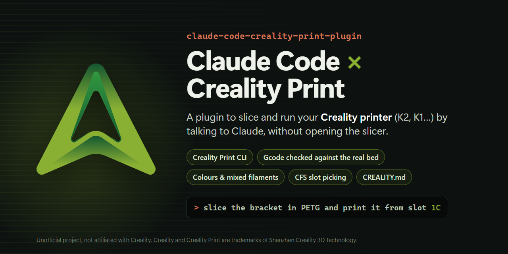

<p align="center"></p>

# claude-code-creality-print-plugin

**English** · [Español](README.es.md)

A [Claude Code](https://code.claude.com) plugin to slice with **Creality Print** and run your
**Creality printer** (K2 family, K1 family…) by talking to Claude, without opening the slicer
window and without OrcaSlicer.

## What it does

- **Slices** STL, 3MF, OBJ and STEP with Creality Print's own engine. It uses the profiles
  selected in the app, the ones in your `CREALITY.md` or the ones you ask for, and changes any
  setting you want.
- **Checks every gcode against the printer's real bed.** It rejects gcode made for another
  machine (a K2 Pro profile that Creality Print picked on its own for a K2, a downloaded 3MF set
  up for a K1C) and gcode that would drive the head off the bed.
- **Colours:** one filament per object, a filament change at a given height, and Creality
  Print 7 **mixed filaments** (virtual filaments that alternate two colours).
- **Adds thumbnails** for the printer's screen.
- **Reads** the printer status, the CFS, the stored files and the job history.
- **Uploads gcode and starts prints the way Creality Print does:** over the port 9999
  websocket it sends `colorMatch` (which CFS slot feeds which extruder) and `multiColorPrint`.
  That is how you pick the slot, which Moonraker's API can't do. Without a CFS, external spool.
- **Remembers your preferences** in a `CREALITY.md`, global or per project, like an `AGENTS.md`.

## Printers

It works with Creality printers running **Creality OS**: Klipper with Moonraker (port 7125) and
the port 9999 service that Creality Print talks to. Models and bed sizes come from Creality
Print's own printer list, so it knows all of them.

| Printer | Status |
|---|---|
| K2 (260 mm) with CFS | **Tested** |
| K2 Pro, K2 Plus, K2 SE | Should work, untested |
| K1, K1C, K1 Max, K1 SE (with or without CFS-C) | Should work, untested |
| Other Creality OS printers (Hi, Ender-3 V3 KE…) | Should work, untested |
| Marlin-based Creality printers (classic Ender-3, CR-10…) | Slicing yes; talking to the printer, no |

If you try another model, please open an issue and tell me how it went.

## MCP tools

| Tool | What it does | Moves the printer? |
|---|---|---|
| `setup_printer` | Finds the printer (in Creality Print or on the LAN) and saves it | no |
| `get_presets`, `save_presets` | The `CREALITY.md` files that apply to a model; create or change them | no |
| `list_notes`, `add_note`, `delete_note` | Your rules, in the global `CREALITY.md` | no |
| `creality_print_info` | Install, version, selected profiles, target printer | no |
| `list_profiles` | Machine, process or filament profiles (only those for your machine) | no |
| `get_profile_settings` | Keys and values of a fully resolved profile | no |
| `list_3mf_objects`, `prepare_multicolor` | Objects in a 3MF; colours per object and by height | no |
| `slice` | Slices and checks, mixed filaments included. Returns `ok_to_print`, problems, time, grams, extruders | no |
| `analyze_gcode` | Checks a local gcode or one stored on the printer | no |
| `open_in_creality_print` | Opens a file in a Creality Print window to look at it | no |
| `printer_status`, `cfs_status`, `printer_files`, `print_history` | Read-only | no |
| `upload_gcode` | Uploads a checked gcode without printing it | no |
| `start_print` | Starts the print with the chosen CFS slots or the external spool | **yes** (needs `confirm` = file name) |
| `control_print` | Pause, resume, cancel | **yes** (cancel needs `confirm`) |

The `creality-print` skill tells Claude how to use them and forbids it to start or cancel
anything without asking you first. Claude answers in your language.

## Install

Requirements:

- Windows with **Creality Print 7.2** installed (tested with 7.2.2.5483).
- [uv](https://docs.astral.sh/uv/) on the PATH. The server declares its dependencies inside
  `server.py` and uv installs them the first time.
- The printer on the same network. The plugin finds it by itself, in Creality Print or by
  scanning the LAN.

```powershell
claude plugin marketplace add marcmayol/claude-code-creality-print-plugin
claude plugin install creality-print@marc-3d
```

Then, in Claude Code: "slice this STL in PETG with 4 walls", "how is the print going?",
"what's in the CFS?", "make the base white and the lettering black from 3 mm up".

## Colours

- **One filament per object**: "the text in black, the base in white". Claude lists the objects
  with `list_3mf_objects` and assigns them with `prepare_multicolor`.
- **Filament change by height**: "white up to 3 mm, then black". It also works on a
  single-body STL: the raised part comes out in another colour.
- **Creality Print 7 mixed filaments**: virtual filaments that alternate two physical ones,
  layer by layer or dithered, to get a third shade. With N filaments, mix 1 is extruder N+1.
  Every change purges, so it takes much longer and uses more filament.
- **Painting individual faces** is still done in the Creality Print window; the 3MF you save
  is then sliced keeping its colours.

## Your data and your CREALITY.md

Nothing of yours ships with the plugin: whatever it needs, it finds out and stores on your PC.

- **The printer.** The first time, `setup_printer` tries the printers saved in Creality
  Print and, if none answers, scans your LAN (ports 9999 and 7125). It stores the IP and model
  in `%APPDATA%\creality-print-plugin\config.json`; the model is what the bed check uses. If
  the IP changes one day, run it again.
- **Your profiles and rules, in `CREALITY.md`.** It tells the plugin what to use so you don't
  have to repeat it: the YAML block between `---` is applied automatically when slicing, and
  the free text underneath holds rules that Claude reads and follows. A commented template is
  in [`CREALITY.example.md`](CREALITY.example.md).

```markdown
---
process: 0.16mm Standard @Creality K2 0.4 nozzle
filaments: [Hyper PLA @Creality K2 0.4 nozzle]
settings:
  wall_loops: 4
  brim_type: outer_only
output_dir: gcode
slots: {"1": 1D}
---
# Wall brackets
Everything in black PLA. Outdoor parts get 4 walls.
```

- **Global**, in `%APPDATA%\creality-print-plugin\CREALITY.md`: always applies. Its `## Notes`
  section is filled in by `add_note` ("my ABS prints at 270 °C", "brim on tall parts").
- **Per project**, in the models' folder or any folder above it: applies to everything inside.
- The file closest to the model wins, and whatever you ask for in the conversation wins over
  all of them. `settings` add up from one level to the next.
- Keys: `machine`, `process`, `filaments` (one filament profile per extruder), `settings`
  (profile keys to change), `output_dir` (relative to the file) and `slots` (CFS slots Claude
  will suggest when printing; it still asks you). The Spanish keys of the first version
  (`maquina`, `proceso`, `ajustes`…) still work.
- Edit it by hand or ask Claude ("for this folder use 0.16 mm and a brim"). It uses
  `save_presets` and first checks that the profiles exist, belong to your printer,
  and that the settings are real keys.

Optional environment variables, if you'd rather set things by hand:

- `CREALITY_HOST`: printer IP or hostname (`K2_HOST`, the old name, still works). Wins over
  everything else.
- `CREALITY_PRINT_EXE`, `CREALITY_PRINT_DATA`: if Creality Print isn't installed in the usual place.
- `CREALITY_PLUGIN_CONFIG`: another path for the config file.

## How it works

- `creality_print.py`: finds the install, resolves profile inheritance (user profiles only
  store what they change), applies settings and calls the CLI.
  - In 7.2 the options use **dashes** (`--load-settings`); with underscores you get
    "Invalid option". Since it's a GUI app, `--help` prints nothing to the console.
  - `--export-3mf` crashes in 7.2.2, so thumbnails are rendered with `stl-thumb.exe` (shipped
    with Creality Print) and inserted by hand.
  - "Plain" 3MF files (with no Creality data) get centred on the bed and one extruder per
    material, which is what the app would do.
  - Colours: each object's extruder goes in `Metadata/model_settings.config`, height changes
    in `Metadata/custom_gcode_per_layer.xml`, and mixed filaments in
    `mixed_filament_definitions` (format from Creality Print 7.2's `MixedFilament.cpp`).
- `gcode.py`: checks the gcode. It only counts moves inside the layers: the start-up purge and
  the colour-change waste chute belong to the machine.
- `impresora.py`: Moonraker (7125) to read and upload; the 9999 websocket to start and control
  prints, with the same messages as Creality Print's `resources/web/deviceMgr`. The gcode folder
  is asked from Moonraker (`/mnt/UDISK/…` on the K2, somewhere else on the K1).
- `config.py`: the saved printer, outside the repo, plus the LAN scan.
- `preconfig.py`: the `CREALITY.md` files (global and per project), how they combine, and the notes.
- `server.py`: the MCP server (FastMCP, stdio).

## Tests

```powershell
python -m pytest -q
```

Tests that need Creality Print or the printer are skipped when they aren't available. The
printer tests only read: no test uploads, prints or pauses anything.

## Status and limits

- Tested on a K2 (base model, 260 mm) with one CFS; other models are untested.
- `start_print` has started real prints on the K2 with a CFS slot mapping. The protocol comes
  from Creality Print's code and from the slot mapping the K2 stores for its jobs.
- Creality Print 7.3 changes the CLI: it needs `--cli`, and `--need-gcode-file`, without which it
  slices, exits with code 0 and deletes the gcode. The plugin adds both when it detects 7.3
  (tested on 7.3.0.6151). 7.3 also refuses `--load-settings` with a 3MF project, so the
  plugin writes the chosen profiles into a copy of the project instead.
- **Known issue on 7.3: mixed filaments (`mixes`) don't slice.** Creality Print loads the mix but
  still writes the virtual extruder (`Invalid T command (T2)`) and aborts with code -100. They
  worked on 7.2.

Personal project, not affiliated with Creality. Creality and Creality Print are trademarks of
Shenzhen Creality 3D Technology. Printing moves a machine with hot parts: check what you send.

## License

MIT
